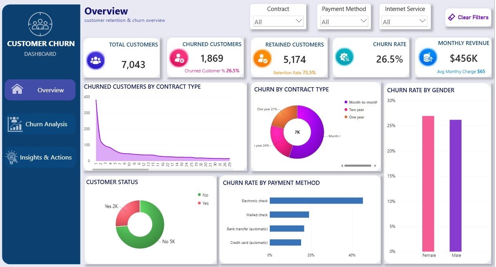
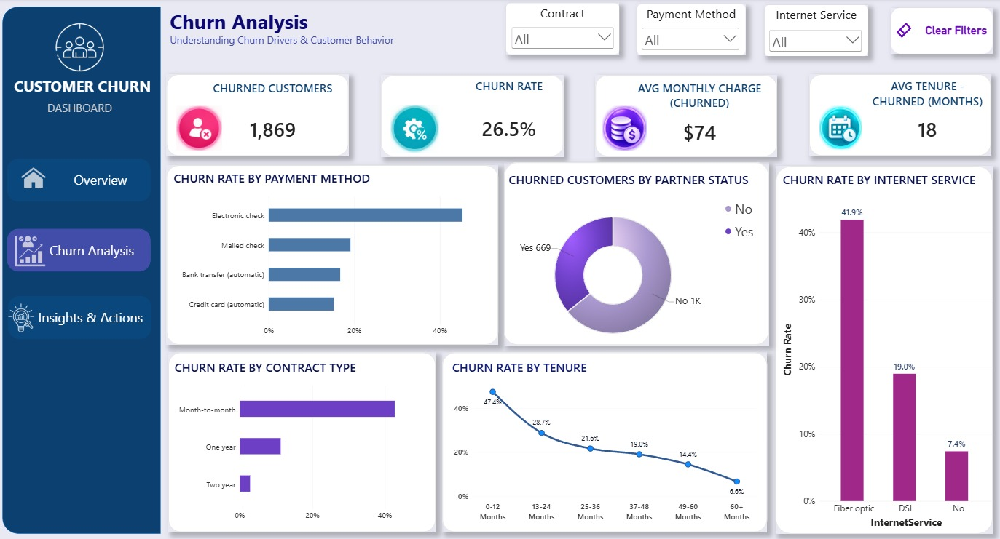
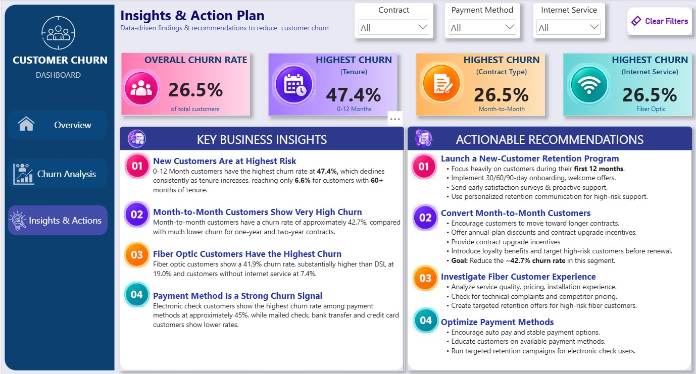

# FUTURE_DS_02 — Customer Retention & Churn Analysis

An interactive **Power BI Customer Churn Dashboard** designed to analyze customer retention, identify major churn drivers, and provide actionable recommendations for reducing customer loss.

The project focuses on understanding **who is churning, why they may be churning, and where retention efforts should be prioritized.**

---

## 🎯 Project Objective

The main objective is to transform customer data into meaningful business insights that can help a company:

- Monitor overall customer churn
- Identify high-risk customer segments
- Understand key churn drivers
- Compare churn across contract types and payment methods
- Analyze churn across internet service types
- Understand the relationship between tenure and churn
- Develop targeted customer-retention strategies

---

## 📌 Dashboard Overview

The dashboard contains **three analytical pages**:

### 1. 📊 Overview

The **Overview** page provides a high-level summary of customer retention and churn performance.

#### Key Performance Indicators

| KPI | Value |
|---|---:|
| Total Customers | 7,043 |
| Churned Customers | 1,869 |
| Retained Customers | 5,174 |
| Churn Rate | 26.5% |
| Monthly Revenue | $456K |
| Avg. Monthly Charge | $65 |

#### Visuals

- Churned Customers by Contract Type
- Churn by Contract Type
- Churn Rate by Gender
- Customer Status
- Churn Rate by Payment Method

---

### 2. 📉 Churn Analysis

The **Churn Analysis** page focuses on identifying the major factors associated with customer churn.

#### Key Performance Indicators

| KPI | Value |
|---|---:|
| Churned Customers | 1,869 |
| Churn Rate | 26.5% |
| Avg. Monthly Charge — Churned | $74 |
| Avg. Tenure — Churned | 18 Months |

#### Visuals

- Churn Rate by Payment Method
- Churned Customers by Partner Status
- Churn Rate by Internet Service
- Churn Rate by Contract Type
- Churn Rate by Tenure

---

### 3. 💡 Insights & Action Plan

The **Insights & Action Plan** page converts the analysis into business-focused conclusions and practical recommendations for improving customer retention.

This page highlights:

- Key churn patterns
- High-risk customer segments
- Retention opportunities
- Business risks
- Recommended actions

---

# 🔎 Key Business Insights

## 1. New Customers Are at the Highest Risk

The **0–12 month** customer group has the highest observed churn rate at **47.4%**.

| Tenure Group | Churn Rate |
|---|---:|
| 0–12 Months | 47.4% |
| 13–24 Months | 28.7% |
| 25–36 Months | 21.6% |
| 37–48 Months | 19.0% |
| 49–60 Months | 14.4% |
| 60+ Months | 6.6% |

### Business Implication

The first year represents the most important retention window. Early engagement, proactive support, and personalized communication can help reduce customer loss.

---

## 2. Month-to-Month Customers Have High Churn

Month-to-month customers show approximately **42.7% churn**, considerably higher than customers on longer-term contracts.

### Business Implication

Contract commitment appears to be strongly associated with customer retention. Encouraging suitable customers to move toward longer-term plans could improve retention.

---

## 3. Fiber Optic Customers Show High Churn

| Internet Service | Churn Rate |
|---|---:|
| Fiber Optic | 41.9% |
| DSL | 19.0% |
| No Internet Service | 7.4% |

### Business Implication

The high churn among fiber customers should be investigated further, particularly around service quality, pricing, technical issues, customer expectations, and competitive pressure.

---

## 4. Payment Method Can Help Identify Risk

Electronic check customers show the highest churn rate among the payment methods analyzed.

### Business Implication

Payment behavior can be used as an additional customer-risk signal when developing churn-risk segments.

---

# 🎯 Actionable Recommendations

## 1. Strengthen New-Customer Onboarding

Focus retention efforts on customers during their first 12 months through:

- 30/60/90-day onboarding programs
- Welcome offers
- Proactive customer support
- Satisfaction surveys
- Personalized communication

---

## 2. Encourage Longer-Term Contracts

Target suitable month-to-month customers with retention incentives such as:

- Annual-plan discounts
- Contract upgrade offers
- Loyalty benefits
- Personalized retention campaigns

---

## 3. Investigate Fiber Customer Churn

Since fiber customers show a **41.9% churn rate**, investigate:

- Service reliability
- Installation experience
- Pricing
- Technical complaints
- Speed expectations
- Competitor offers

---

## 4. Optimize the Payment Experience

Use high-churn payment segments for:

- Payment education
- Easier payment options
- Auto-payment campaigns
- Targeted retention messaging

---

## 5. Build a Churn-Risk Segmentation Strategy

Combine multiple customer attributes to identify high-risk segments.

For example:

> **New Customer + Month-to-Month Contract + Fiber Optic Service**

can be treated as a **high-priority retention segment**.

---

# 📊 Important Metrics

### Churn Rate

```text
Churn Rate = Churned Customers / Total Customers
```
### Retention Rate
```text
Retention Rate = Retained Customers / Total Customers
```
### Churned Customer Couunt
```text
Churned Customers = Number of customers where Churn = "Yes"
```

# 🎛️ Interactive Filters

The dashboard provides interactive slicers for:

- Contract
- Payment Method
- Internet Service

These filters allow users to explore churn patterns across different customer segments.

# 🛠️ Tools & Technologies

- Microsoft Power BI
- Power Query
- DAX
- Data Visualization
- Business Intelligence
- GitHub

## 📸 Dashboard Preview

### Overview



### Churn Analysis



### Insights & Action Plan



# 📂 Repository Structure

```text
customer-churn-powerbi/
│
├── Dataset/
│   └─ Telco_Customer_Churned_Cleaned.csv
│
├── README.md
│
├── Documentation/
│   └─ Customer_Retention_Analysis.pdf
│
└── Screenshots/
    ├── Overview.jpeg
    ├── churn_analysis.jpeg
    └── insights_action_plan.jpeg
```
